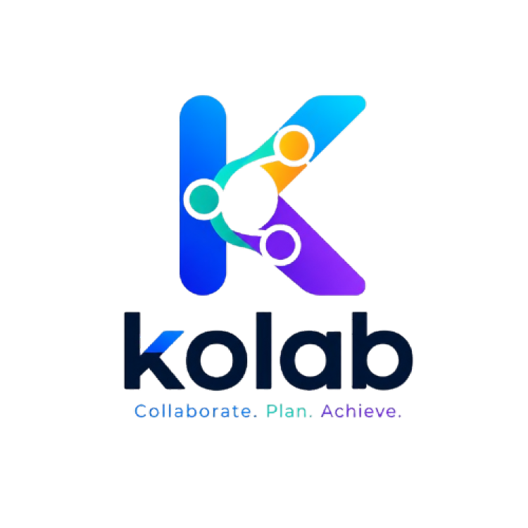
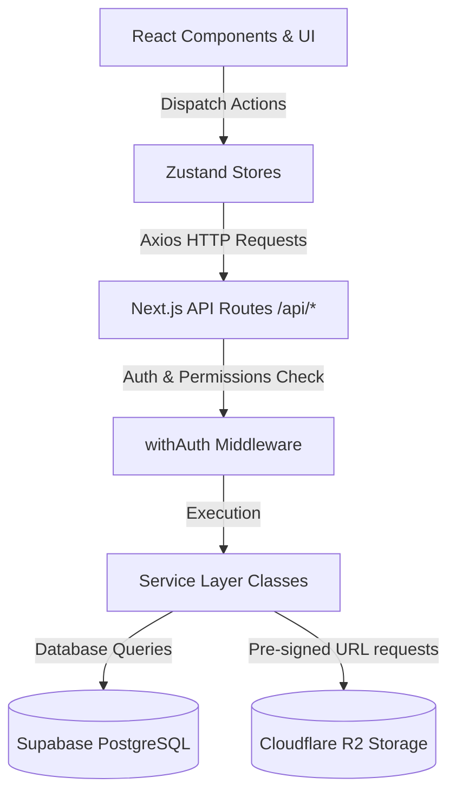
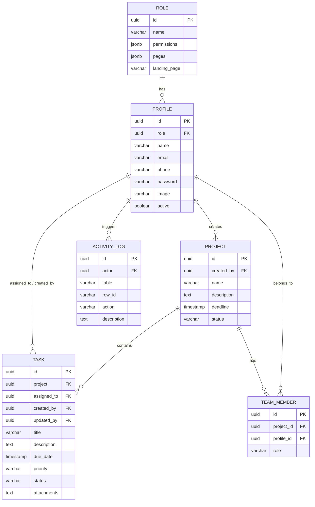

<!--
  Kolab - Smart Project & Task Collaboration System
  Professional Project Documentation
-->

<div align="center">
  
  <h1>Kolab</h1>
  <p><strong>Smart Project & Task Collaboration System</strong></p>
  <p><em>Empower Your Team, Simplify Your Projects, and Track Work in Real-Time</em></p>

  <!-- Badges -->
  <p>
    <a href="https://nextjs.org">
      
    </a>
    <a href="https://react.dev">
      
    </a>
    <a href="https://tailwindcss.com">
      
    </a>
    <a href="https://supabase.com">
      
    </a>
    <a href="https://cloudflare.com">
      
    </a>
    <a href="https://typescriptlang.org">
      
    </a>
  </p>
</div>

---

## 📖 Table of Contents

- [Overview](#-overview)
- [Key Features](#-key-features)
- [Tech Stack](#-tech-stack)
- [System Architecture](#%EF%B8%8F-system-architecture)
- [Directory Structure](#-directory-structure)
- [Getting Started & Setup Guide](#-getting-started--setup-guide)
  - [Prerequisites](#prerequisites)
  - [Step 1: Clone & Install](#step-1-clone--install)
  - [Step 2: Environment Setup](#step-2-environment-setup)
  - [Step 3: Database & Supabase Config](#step-3-database--supabase-config)
  - [Step 4: Development Server](#step-4-development-server)
- [Environment Variables Template](#-environment-variables-template)
- [Database Schema & Relationships](#%EF%B8%8F-database-schema--relationships)
- [Permissions & RBAC Model](#-permissions--rbac-model)
- [Contributing](#-contributing)
- [License](#-license)

---

## 🌟 Overview

**Kolab** is a premium, enterprise-grade project management and collaboration platform. It provides organizations with a centralized hub to create projects, partition work into granular tasks, assign members, handle complex access control roles, upload deliverables directly to cloud storage, and monitor team workload through rich, responsive analytical dashboards.

Built on **Next.js 16 (App Router)** and **React 19**, it utilizes a robust **Role-Based Access Control (RBAC)** security system, **Supabase** for high-performance data querying, and **Cloudflare R2** for fast, secure client-side attachment uploads.

---

## ✨ Key Features

### 📊 1. Analytical Dashboard & Insights

- **KPI Tracking:** Real-time visibility into total projects, completed/pending/overdue tasks.
- **Visual Charts:** Task distribution graphs categorized by priority, project status, and overall project progress trends.
- **Workload Summaries:** Intuitive tracking of tasks assigned per member, showing total completed vs. pending tasks.
- **Productivity Tools:** Quick summaries of high-priority tickets, upcoming deadlines, and recent updates.

### 📁 2. Project Lifecycle Management

- **Interactive CRUD:** Create, read, update, and delete projects with statuses like `ACTIVE`, `COMPLETED`, and `ON_HOLD`.
- **Dynamic Access Guards:** Read/Write permissions are filtered by owner context (`project:update:own` vs. `project:update:all`).
- **Deadlines & Tracking:** Detailed project tracking view containing integrated timelines and progress indicators.

### 📋 3. Task Management & Workflows

- **Task Lists & Boards:** Organize tasks using priority tags (`High`, `Medium`, `Low`) and statuses (`Todo`, `In Progress`, `Completed`).
- **Conflict Prevention:** In-built business validation preventing duplicate task titles in a project, assignment of completed tasks, and past-due date selection.
- **Task Details:** Rich comment sections and file attachments mapped directly to tasks.

### 🛡️ 4. Role-Based Access Control (RBAC)

- **Customizable Roles:** Fine-grained permissions assigned to standard roles like `Admin`, `Project Manager`, `Team Member`, and `HR Manager`.
- **Unified Route Guards:** Automatic UI navigation and endpoint security enforcement mapped through `permission.config.ts`.
- **Middleware Protection:** Upgraded `withAuth` Higher-Order Function that accepts single config payloads and injects route context, permissions, and request variables natively.

### 👥 5. Team & HR Management

- **Employee Directories:** Direct profile configuration, editing, and status toggles (Active/Suspended).
- **No Public Signups:** Secure member creation exclusively handled by authorized personnel (HR Manager or Admin).
- **Project Allocations:** Add team members directly to projects and manage role boundaries.

### 🪵 6. System Activity Logging

- **Audit Trail:** Fire-and-forget, non-blocking asynchronous log service generating natural-language history logs (e.g. _"Task 'Setup API' assigned to John"_).
- **Traceability:** Dashboard and dedicated log viewer tracking team operations for transparent auditing.

### ☁️ 7. File Attachments (Cloudflare R2)

- **Direct S3 Uploads:** Secure client-side uploads directly to Cloudflare R2 bucket using server-signed, temporary pre-signed upload URLs.

---

## 🛠️ Tech Stack

- **Core Framework:** Next.js 16.2.4 (App Router) & React 19.2.4
- **Language:** TypeScript 5.x
- **Styling:** Tailwind CSS v4, shadcn/ui components, Radix UI primitives
- **Animations:** Framer Motion (v12), tw-animate-css
- **State Management:** Zustand v5 (with persist-middleware for local storage syncing)
- **Database Client:** Supabase JS v2
- **File Storage:** Cloudflare R2 S3 SDK (`@aws-sdk/client-s3`, `@aws-sdk/s3-request-presigner`)
- **Security & Encryption:** Jose v6 (JWT validation), Argon2 (Password hashing)
- **Date Processing:** date-fns

---

## 🏗️ System Architecture

Kolab uses a highly clean and scalable architecture where operations flow unidirectionally from the user interface down to database layers:



---

## 📂 Directory Structure

Below is an overview of the key directories within the workspace:

```text
kolab/
├── app/                      # Next.js App Router root
│   ├── (pages)/              # Protected application views (Dashboard, Tasks, etc.)
│   ├── api/                  # Backend route handlers (Auth, Projects, Tasks, etc.)
│   ├── globals.css           # Global stylesheets and Tailwind CSS configuration
│   ├── layout.tsx            # Main layout wrapper and ThemeProvider injection
│   └── page.tsx              # Public home marketing & landing page
├── components/               # UI and feature components
│   ├── core/                 # App Shell, Protected routing, Theme, and Sidebar Navs
│   ├── hr/                   # Feature-specific components (Forms, Dashboards, Tables)
│   ├── shared/               # Reusable template components (List views, Filters)
│   └── ui/                   # shadcn base atomic components (Button, Dialog, Select)
├── config/                   # Configuration parameters
│   ├── env.config.ts         # Environment variables parser
│   ├── permission.config.ts  # Resource-to-page permission maps and RBAC mappings
│   └── site.config.ts        # Sidebar lists, navigation, and brand setup
├── docs/                     # Technical plans, specs, and requirements
├── hooks/                    # Reusable React hooks (Debounce, Filters, Auth, etc.)
├── lib/                      # Helper modules
│   ├── api/                  # JWT keys, Argon2 hashers, and API responses
│   └── date.utils.ts         # Timezone formats and timestamp builders
├── public/                   # Static media (logo.png, icons, images)
├── schema/                   # Zod verification schemas (Validation rules)
├── services/                 # Database & S3/R2 direct communication services
├── store/                    # Client state management (Zustand)
└── types/                    # TypeScript interfaces
```

---

## 🚀 Getting Started & Setup Guide

### Prerequisites

Make sure you have the following installed:

- [Node.js](https://nodejs.org/) (v18.x or v20.x recommended)
- [npm](https://www.npmjs.com/) or yarn
- A [Supabase](https://supabase.com) account & project database
- A [Cloudflare R2](https://www.cloudflare.com/developer-platform/products/r2/) bucket (or S3 equivalent)

### Step 1: Clone & Install

```bash
# Clone the repository (or navigate to workspace directory)
cd kolab

# Install package dependencies
npm install
```

### Step 2: Environment Setup

Copy the environment template file and replace the placeholder values:

```bash
cp .env.example .env
```

Open the `.env` file and input your Supabase credentials, JWT keys, and Cloudflare R2 bucket details.

### Step 3: Database & Supabase Config

Run the SQL DDL commands in your Supabase SQL editor to initialize tables. The application depends on the following schemas:

- `role` (permissions, landing page, page definitions)
- `profile` (user attributes, passwords, status, references `role`)
- `project` (name, status, deadlines, references `profile`)
- `task` (title, project references, assignee, due date, status, priority)
- `team_member` (project to profile connection table)
- `activity_log` (actor description, timestamps)

Ensure you insert standard seed data for roles (`admin`, `project_manager`, `member`, `hr_manager`) to sign in.

### Step 4: Development Server

Run the local dev server:

```bash
npm run dev
```

Open [http://localhost:3000](http://localhost:3000) on your browser.

---

## 🔒 Environment Variables Template

Use these variables to connect the application. Make sure they match your actual service keys:

```env
# Application Configuration
NEXT_PUBLIC_APP_URL=http://localhost:3000

# Supabase Configuration
NEXT_PUBLIC_SUPABASE_URL=https://your-supabase-project.supabase.co
SUPABASE_SECRET_KEY=your-supabase-service-role-key

# JWT Authentication
JWT_SECRET_KEY=your_jwt_secret_key_here
JWT_EXPIRES_IN=1d
JWT_REFRESH_EXPIRES_IN=15d

# Cloudflare R2 Storage (S3 Compatible)
R2_BUCKET_NAME=kolab
R2_ID=your_cloudflare_r2_account_id
R2_KEY=your_cloudflare_r2_access_key_id
R2_SECRET=your_cloudflare_r2_secret_access_key
R2_PUBLIC_URL=https://your-r2-public-domain-or-bucket-url.com
```

---

## 🗃️ Database Schema & Relationships

Below is the Entity-Relationship (ER) diagram representing the database tables, field data types, and primary key (PK) / foreign key (FK) relations:



### Table Metadata Reference

| Table | Primary Key | Key Relations | Fields |
| :--- | :--- | :--- | :--- |
| **role** | `id` (uuid) | - | `name`, `permissions` (jsonb), `pages` (jsonb), `landing_page` |
| **profile** | `id` (uuid) | `role` ➔ `role.id` | `name`, `email`, `phone`, `password`, `image`, `active` |
| **project** | `id` (uuid) | `created_by` ➔ `profile.id` | `name`, `description`, `deadline`, `status` (`ACTIVE`/`COMPLETED`/`ON_HOLD`) |
| **task** | `id` (uuid) | `project` ➔ `project.id`, `assigned_to` ➔ `profile.id` | `title`, `description`, `due_date`, `priority` (`High`/`Medium`/`Low`), `status`, `attachments` |
| **team_member** | `id` (uuid) | `project_id` ➔ `project.id`, `profile_id` ➔ `profile.id` | `role` (project-specific role) |
| **activity_log**| `id` (uuid) | `actor` ➔ `profile.id` | `table`, `row_id`, `action`, `description` |

---

## 🔐 Permissions & RBAC Model

System authorization is configured dynamically. When a user requests a page, the `PageAccessGuard` evaluates their role definition. When calling API endpoints, the `withAuth` middleware checks permissions based on standard actions:

```typescript
// Example from config/permission.config.ts
export const PERMISSION_MODULES = [
  {
    label: "Project Management",
    permissions: [
      { resource: "project", action: "create" },
      { resource: "project", action: "read", condition: "all" },
      { resource: "project", action: "read", condition: "own" },
      { resource: "project", action: "update", condition: "all" },
      { resource: "project", action: "update", condition: "own" },
      { resource: "project", action: "delete" },
    ],
  },
  // Similar blocks exist for task, team, log, roles, users, and settings modules.
];
```

- **Condition `all`**: Allows global data visibility.
- **Condition `own`**: Restricts actions only to records created by the logged-in user profile.
- **Condition `assigned`**: Limits task lists and updates only to items assigned directly to the current member.

---

## 🤝 Contributing

1. Fork the Project.
2. Create your Feature Branch (`git checkout -b feature/AmazingFeature`).
3. Commit your Changes (`git commit -m 'Add some AmazingFeature'`).
4. Push to the Branch (`git push origin feature/AmazingFeature`).
5. Open a Pull Request.

---

## 📄 License

Distributed under the MIT License. See `LICENSE` for more information.
